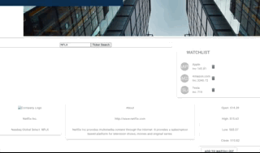
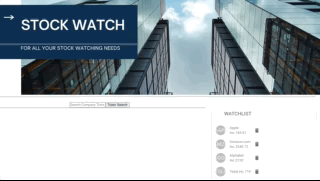
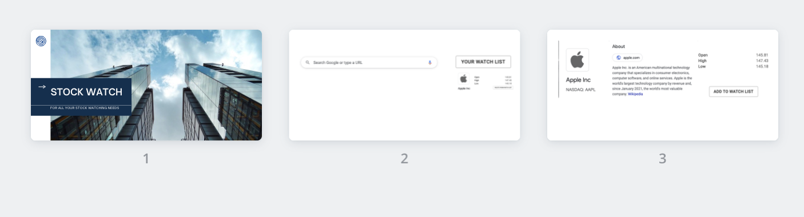

# WATCH STOCK

> AN APPLICATION TO KEEP WATCH OF STOCKS

#### Table of Contents

- [APP NAME](#)
  - [Technologies](#Technologies)
  - [Development](#Development)
    - [Architechture](#Architecture)
  - [Installation](#Installation)
  - [Operation](#Operation)
  - [Preview](#Preview)
  - [Process](#Process)
  - [License](#License)

### Technologies

| Stack      | Dependancies | Dev-dependancies |
| ---------- | ------------ | ---------------- |
| NodeJS     | axios        | nodemon          |
| ReactJS    | ReactJS      | prop-types       |
| ExpressJS  | React-DOM    | Webpack/Babel    |
| JavaScript | ExpressJS    |                  |
| TypeScript |              |                  |
| MongoDB    |              |                  |

### Development

> ### Architecture
>
> For this application, I decided on MVC Architecture because this is a simple application and this architecture will allow me to keep code duplication to a minimum as it seperates data and business logic from the display.
>
> > Model: Data
> > View: UI
> > Controller: Request - Response handlers

> ### Introduction
>
> WATCH STOCK was built as a full-stack application utilizing Typescript. It is configured for Front-end development using ReactJS library with the help of both Typescript language and the Material-UI library. For Back-end development it was built using MongoDB as the Database and ExpressJS with the help of Typescript.

> Check out [Operation](#Operation) for an overview of the services' functionality or the [Preview](#Preview) below for a demonstration of all features.

> ### Prerequisite
>
> First, make sure that you have MongoDB installed on your machine and in your terminal start mongo.

### Installation

1. Clone repository.
2. From within the root directory:

`npm install`

3. From within the root directory:

`npm run build:dev `
`npm run server`

4. View in browser:

`http://localhost:3000`

### Operation

> ### User Stories
>
> - User can search Company by symbol(ticker)
> - User can save Company Stock to Watchlist
> - User can delete Company Stock from Watchlist

> ### Integration
>
> - WATCH STOCK is integrated with a backend developed in MongoDB
> - WATCH STOCK is integrated with the 3rd party RESTful API from polygon.io

> ### Material-UI Usage
>
> WATCH STOCK makes use of the following 5 UI components from the material-ui/@core library
>
> - Material-UI Grid
> - Material-UI Button
> - Material-UI List
> - Material-UI CSS-Baseline
> - Material-UI

> ### Self-Constructed Reusable Component
>
> - In WATCH STOCK the search bar was constructed by me as a reusable component

### Preview

### Process

### License

[]
